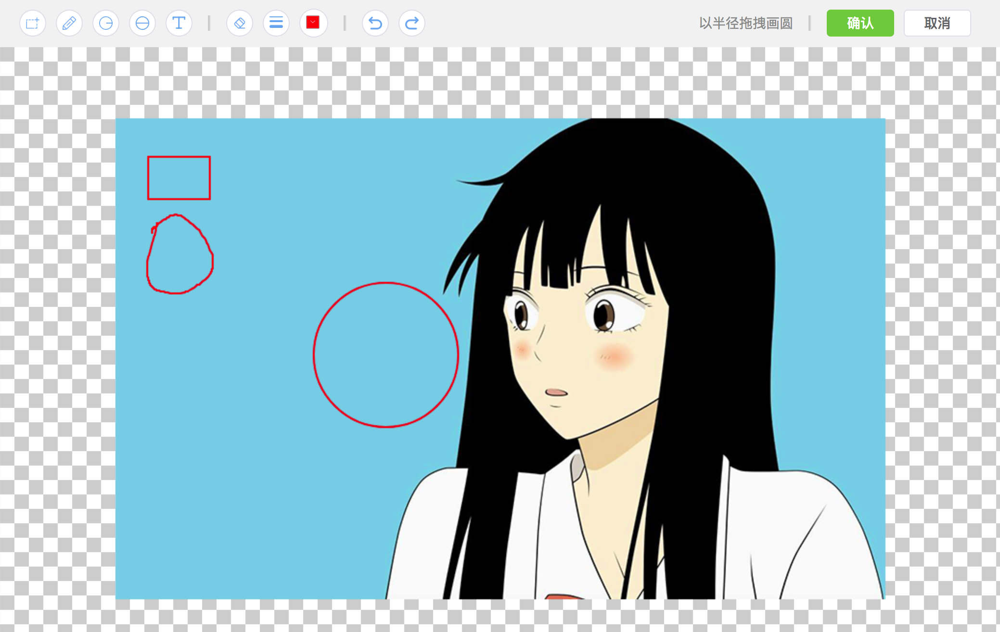

## 基于 vue + element-ui 的图片标记功能



> 主要功能并不依赖element-ui

<br/>

**DEMO**     
https://cp0725.github.io/img-drawing/dist/index.html

**安装**   
`npm i img-drawing --save`   

**使用**
```
<template>
  <div>
    <el-button @click="openDrawing">开始画图</el-button>
    <div class="drawing-wrap" v-if="drawingStatus">
      </img-drawing>
    </div>
    
  </div>
</template>

<script>
import imgDrawing from 'img-drawing'
export default {
  data() {
    return {
      drawingStatus: false,
      imgBase64: ''
    }
  },
  methods: {
    openDrawing(){
      this.imgUrl = '/assets/images/img_03.jpeg'
      this.drawingStatus = true
    },
    closeDrawing(imgBase64){
      console.log(imgBase64 ? '用户点击了保存' : '用户点击了取消')
      this.imgBase64 = imgBase64
      this.drawingStatus = false      
    }
  },
  components: {
    imgDrawing
  }
}
</script>

<style scoped lang="scss">
.drawing-wrap{
  position: fixed;
  left: 0;
  right: 0;
  top: 0; 
  bottom: 0; 
  z-index: 2000;
  /* z-index: 2000是个合适的值可以刚好不覆盖elementUi */
}
</style>
```

**运行DEMO**  
`cd ./node_modules/img-drawing`  
`npm run start`

**关于跨域**     
图片的读写已设置 `image.crossOrigin = 'anonymous'` 但是由于服务端的限制依然可能存在跨域的问题，出现跨域请联系服务端开放相应限制。